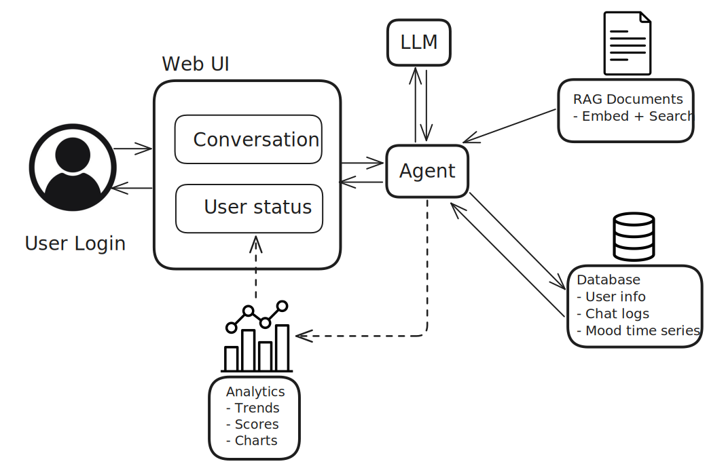

# Design Diagram Descriptions

## D0
In this highest level view, users are able to interact with the web application hosting the chatbot. End users can send messages typed into the chatbot and view chatbot options to modify their experience (delete history, edit message, etc.). The mental chatbot will then output responses to any messages received, offer suggestions based on how it has analyzed the user's mood, and provide visual health charts/trends for the user to track their progress.

Users can also input personal notes into a journal to look back on their progress or reflection on by inserting additional comments. Users also are also capable of submitting questions for system users if they need help understanding certain features or just wish to leave feedback. They can modify their account information from this system interface as well. System users are capable of responding to end user questions and query the system to retrieve system status as well as the current number of active users.

## D1
In this diagram, we break the chatbot into major components. The Web UI handles conversation via chat window and user status (profile/health checkins). Then the agent will route the user input to the right components, call the right tools, integrate LLM, database, and RAG retrieval. The LLM will generate empathetic replies. RAG Documents will store provided mental related docs as embeddings and support search retrieval. Database will store user information, chat logs (histories), and mood time series. Finally, analytics component will convert those into trends, scores, and charts for the user and evaluation metrics for admins.

## D2
In this diagram, we'll take a look inside the Agent Component. It will load prior chat histories from the Database in order to continue the conversation, then fetche relevant documents, and prepare the structured request to the LLM. Some of the tools the Agent can access are Query Engine and Progress Tracker. Query Engine will first search the index in vector storage using the user's question, then selects the most relevant nodes (small chunks of text or knowledge). This step prepares the best possible context for answering the question, and the selected nodes are combined and passed into the LLM. Progress Tracker will stores scores or mood checkins into the Database for long term analytics. 

About RAG pipeline component, it first receives unprocessed/raw documents, following preprocessing steps: token splitter to split long text into chunks, add a brief summary to the metadata, and convert them into vector form for semantic search. Then those structured chunks of knowledge (nodes) are stored in the database to allow the system to quickly find semantically similar context to a user's query. Also, the frequently used nodes are stored in a cache for fast retrieval, which can save time and compute.

